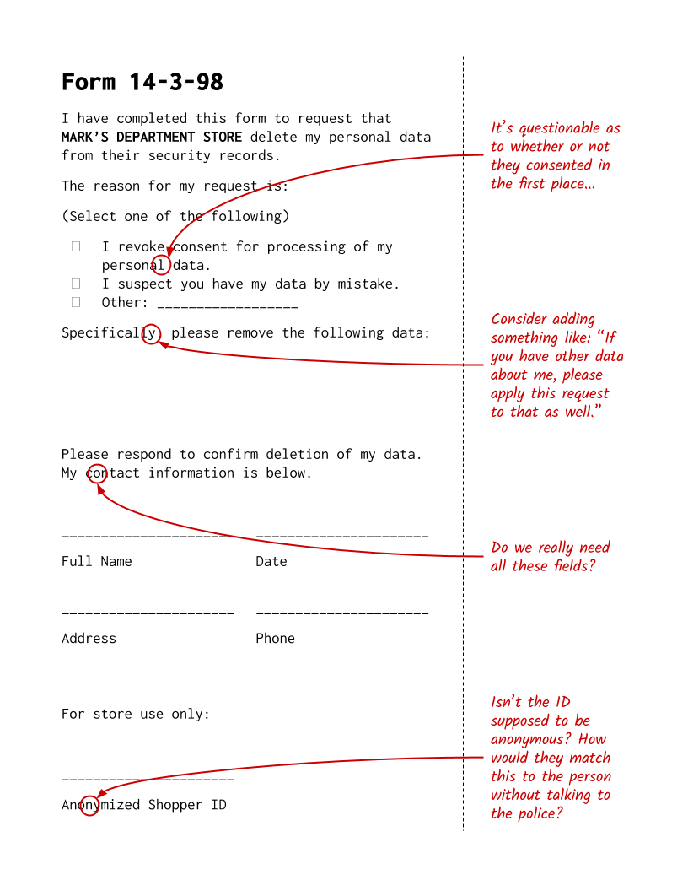

# Policy Review

Someone at the all-hands meeting asked about opt-out policies for surveillance footage. The security system vendor sent us over this form that they have for clients who want to provide opt-out. I guess we'll do it and have the webmaster put it on our site somewhere.

The legal team took a quick once-over and had some feedback. We'll have to reach out to the vendor to ask about this, since we didn't write it.

By the way, did someone provision an access code so the new loss prevention staff can use the Attention Layer?

