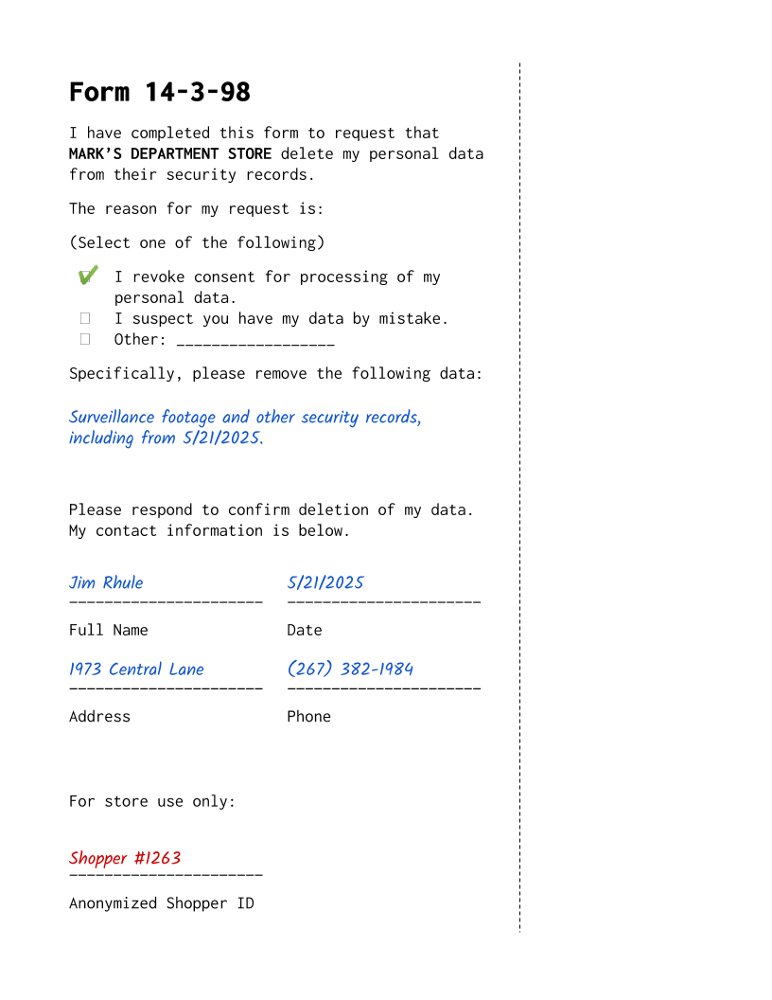

# Subject: Removal Request

**From:** security@marksdepartmentstore.com

**To:** loss@marksdepartmentstore.com

---

Hi Loss Prevention Team,

We actually received a request from a customer to have their data removed from our security system. We don't get these often, it's a pretty obscure form.

Anyway, the system found a match and I have filled in the anonymous shopper ID so you can use this in your investigation.

Just to be safe, we'll wait until after you complete your investigation to delete their data. If they're a suspect, the police will want the footage.

Steve