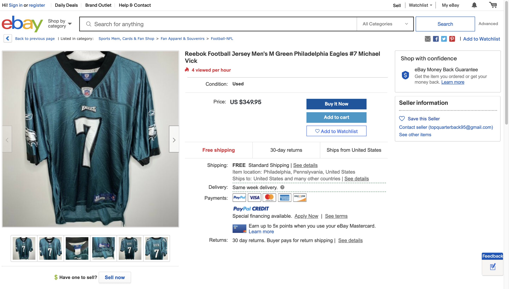

# Reseller Screenshot

We got a tip about a jersey that just went up for sale online in our city. Posting seems to match the predicted time of theft.

It's common for shoplifters to markup stolen merchandise (in this case, double our price) and to use images from online rather than actual pictures of the stolen merchandise.

See if you can match up the seller info to any suspects. I think we have some tools for that.

