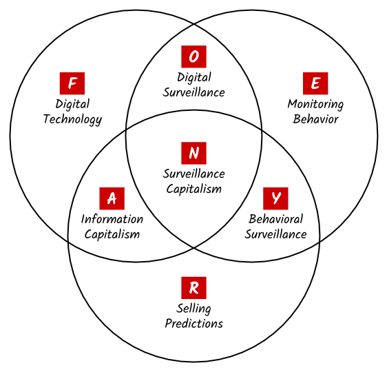

# Venn Diagram

Today, I read an interesting article by Dr. Shoshana Zuboff about surveillance capitalism:

<a target="_blank" href="https://www.theguardian.com/commentisfree/2019/jul/02/facebook-google-data-change-our-behaviour-democracy">https://www.theguardian.com/commentisfree/2019/jul/02/facebook-google-data-change-our-behaviour-democracy</a>

I made a venn diagram based on that article, which I think is pretty cool. Anyway, I also came up with a clever way to remember the password to an important email...

Man, I really hate those tech companies profiting off my data.

1. Text-to-speech tool that does not save any audio data and provides end-to-end encryption for your text data.
1. Research firm sells an airline company analytics for the optimal time to conduct repairs, based only on the condition of the planes.
1. Social media website analyzes which posts each user likes to help advertisers find their target audience.
1. Credit card company monitors its card holders’ purchase activity to prevent purchases that seem fraudulent.
1. Insurance company provides a device to measure how people drive and raises rates for drivers deemed unsafe.
